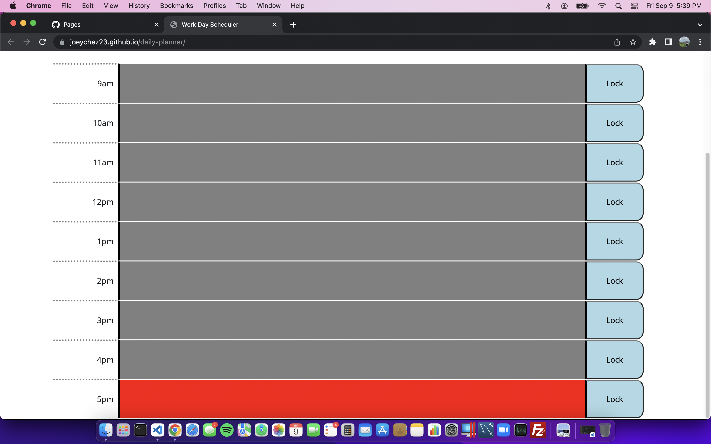
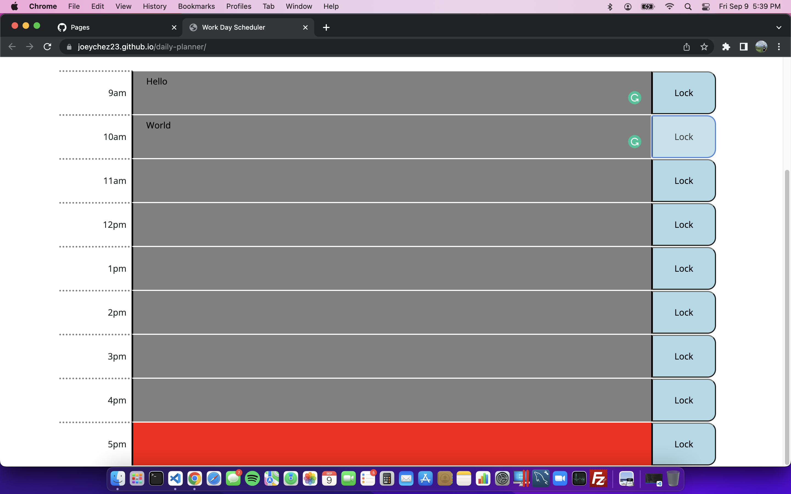
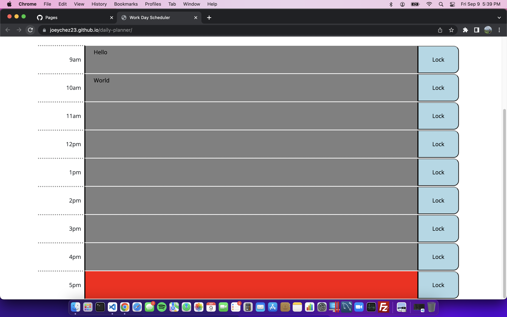

# Daily-Planner

##Description

When the site is loaded all the text boxes that are still available will be in green along with the current hour in red. All hours that have passed will be greyed out. All text boxes can write text and once text is written if the "lock" button is clicked the values will be saved. So if the site is reloaded it'll contain the contents written in that said box. The site also uses jQuery to when using DOM manipulation inside the "script.js" file. The site will also post the day at the top of the page. If the site is running into the next day it will erase the last days values. NOTE I could run this concurently but I can't use and external server file so I added an erase button in case the site was not open to see the "12:00:00 AM" for the .js file to read. This problem could've been solved ("locally") by storing the values by the day but because the site does not ask for the data for a pervious day, I felt it was bad practice to save it in the database esspecally because localstorage doesn't have seperatated value locations like NOSQL or SQL so the keys could hold input data from the last site(quiz) thus screwing up my code because it takes the wrong input values thus causing it to not run correctly.

## Output

Images of the site are shown below. The site meets all the criteria of the rubric

Pictures of the site will be provided bellow:

## Pages

https://joeychez23.github.io/daily-planner/

## Repo

https://github.com/Joeychez23/daily-planner
